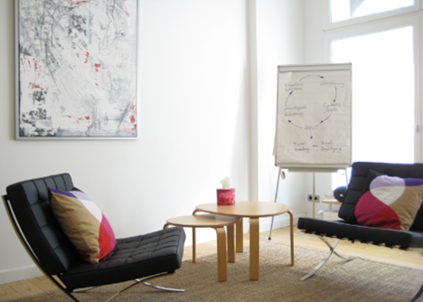

+++
title = "Generation Z- wie sie tickt und warum?"
date = "2023-06-02"
draft = false
pinned = false
tags = ["Deutsch", "Reportage"]
image = "gen-z.jpg"
description = "Wir alle begegnen fast täglich der Gen Z. Besonders andere Generationen können das Denken und Handeln dieser Generation oftmals nicht nachvollziehen. Gen Z ist die erste Generation, welche bereits in ihrer Kindheit mit Medien konfrontiert wurde. \n\n\n"
footnotes = "Bild 1: <https://www.psychologie.ch/member/regina-hess>\n\nBild 2: <http://www.psychotherapie-kloeber-obst.de/>"
+++

Eine Reportage von Ilona Hapeyenka und Lia Graber.




### Definition Gen Z

Als Generation Z oder Gen Z bezeichnet man alle Personen, die zwischen 1995 und 2010 geboren wurden. Andere Quellen ziehen wiederum die Jahre 1996 oder 2000 als den Start der Generation Z heran – das genaue Start- und Endjahr ist demnach nicht klar definiert. 
Gen Z ist die erste Generation, die seit der Kindheit mit digitalen Medien konfrontiert wird.


> *«Selbstverständlich kann man nicht einfach eine ganze Generation über einen Kamm scheren. Aber gewisse Moden und Strömungen gibt es schon, die für eine Altersgruppe zumindest typisch sind».*  
>
> Wilfried Porth

## «Typisch Gen Z!»

Die heutige Generation lebt nach dem Motto: «YOLO». Dies heisst so viel wie «you only life once» - «man lebt nur einmal». Dieser Leitspruch ist für die Gen Z eine Art Leitbild. Ihnen ist Freizeit besonders wichtig, weshalb sie sie oftmals über die Karriere stellen. 
Gen Z wurde in ein digitales Zeitalter hineingeboren, sodass heutzutage fast niemand von ihnen ohne Internetverbindung auskommt. Das Smartphone ist für diese Generation ein treuer Begleiter. 
Laut einer Studie ([http://www.sprachenrat.bremen.de/files/aktivitaeten/Generation_Z_Metastudie.pdf) ](http://www.sprachenrat.bremen.de/files/aktivitaeten/Generation_Z_Metastudie.pdf)haben Jugendliche im Schnitt eine Bildschirmzeit von 17,8h in der Woche. Durch dieses hohe Medienverhalten wurde bestätigt, dass Gen Z eine geringere Aufmerksamkeitspanne hat, gegenüber anderen Generationen. 
Doch dieser Konsum von Medien hat auch positive Auswirkungen, denn die Jugendlichen haben eine sehr starke Meinung und sind im Allgemeinen sehr neugierig. Sie sind offen für neue Dinge und wollen sich ein breites Wissensspektrum aufbauen. Auch gesellschaftliche Themen sind dieser Generation besonders wichtig. Sie setzen sich hauptsächlich für Gerechtigkeit und Diversität in der Gesellschaft ein. Trotzdem macht sich bemerkbar, dass das reale Leben zunehmend mit dem digitalen Leben verschmilzt. 
Die Gen Z ist einer grossen Informationsflut ausgesetzt, weshalb man sich oft falsch informiert und in die Irre geführt wird. Soziale Medien bereiten der Generation nicht nur Freude, sondern werfen auch grosse Probleme und Schwierigkeiten auf. Die Jugendlichen vergleichen sich häufig mit Models und Influencer*innen. Es führt oftmals auch soweit, dass sie sich mit ihren eigenen Freunden und Bekannten vergleichen. Viele Dinge sind in den Medien oft verfälscht oder bearbeitet, worauf viele reinfallen. Durch die grosse Informationsflut haben die Jugendlichen Mühe sich zu entscheiden. Es gibt zu viele Informationen und zu wenig Zeit. 
Die Gen Z blickt weniger optimistisch in die Zukunft als andere Generationen. Dies ist auf viele der oben genannten Gründe zurückzuführen.
Nach einer Studie ([https://www2.deloitte.com/de/de/pages/innovation/contents/millennial-survey-2019.html) ](https://www2.deloitte.com/de/de/pages/innovation/contents/millennial-survey-2019.html)von 2019 wurde aufgezeigt, dass die Gen Z sorgenvoll in die Zukunft blickt. Einerseits bereitet die Klimakrise vielen Jugendlichen Sorgen, anderseits sind es oftmals private und/oder psychische Probleme. 
«Die Jugendstudie von 2022 zeigte, dass die Generation Z ihre Zukunftsaussichten gefährdet sieht. Die Covid-19-Krise und der Krieg in der Ukraine beeinträchtigen ihr Sicherheitsgefühl. Die Studie zeigt, dass bei Jugendlichen das Gefühl verbreitet ist, die Kontrolle über das eigene Leben zu verlieren. Bei vielen ist die psychische Belastung gestiegen, fast die Hälfte fühlt sich unter Stress, mehr als jeder Dritte spricht von Antriebslosigkeit. Dazu hat auch der Verlust von Kontakten während der Pandemie beigetragen. Umso mehr sucht Gen Z den Rückhalt oftmals bei der Familie und engen Freunden. Sie sind dankbar, wenn jemand ihre Probleme anhört und ihnen Ratschläge gibt.»\
Man spricht schon lange von Teenagern, die an Depressionen leiden und später Suizid begehen. Menschen unserer Generation werden oft missverstanden. Süchtig nach Smartphone und Selfies, voller Anforderungen, faul und gleichzeitig übertrieben, das ist die Gen Z. Viele denken, die Ursache der Welle psychischer Probleme sei allein die Schuld des Lockdowns. 
Leider gibt es noch zu wenig Forschung zu den Verhaltensweisen und Wertvorstellungen von Angehörigen der Generation Z in ihrem Alltag. Aus diesem Grund konnten wir darüber nicht so grosszügig recherchieren und deswegen waren wir sehr froh, Interviews durchführen zu dürfen. 

## «Anfragen für psychologische Behandlungen steigen.»

An einem regnerischen Donnerstag, den 30.03.2023 waren wir sehr erfreut unser Interview durchzuführen. Mit dem Bus fuhren wir in die Lorraine, um pünktlich um 11 Uhr für unser Gespräch einzutreffen. Bereits Wochen vorher haben wir uns spannende und lehrreiche Fragen überlegt. Regina Hess ist eine diplomierte Psychologin, welche sich auf Jugendliche und Kinder mit psychischen Problemen spezialisiert hat. Seit dem Jahr 2022 hat sie ihre eigene Praxis in der Lorraine, wo sie ihre Kund*innen professionell betreuen kann. Aus diesem offenen Gespräch mit ihrer breiten Erfahrung konnten wir viele neue Erkenntnisse über Gen Z machen. Wir sind ihr sehr dankbar für die Zeit, welche sie sich genommen hat.

Besonders herausgestochen in diesem Gespräch ist das Hauptthema psychische Gesundheit. Sie erzählt uns, dass besonders das Verständnis für die psychische Gesundheit viel mehr vorhanden ist als in vorderen Generationen und offener darüber gesprochen wird. Sie denke auch, dass die Pandemie bei vielen der Start ihrer psychischen Probleme war. Die Jugendlichen oder damals noch Kinder litten an fehlenden sozialen Kontakten, trieben zu wenig Sport, waren oftmals überfordert mit ihrem Schulstoff, und so weiter.

In ihrem Berufsfeld spüre sie deutlich, dass die Anfragen für psychologische Behandlungen steigen. Dies erkläre sie sich einerseits aus den vielen Anforderungen, denen die Jugendlichen gerecht werden müssen, andererseits hat die Digitalisierung sicherlich einen grossen Einfluss. Durch die Digitalisierung stehe man vor einer grossen Informationsflut. Täglich werden die Jugendlichen von Bildern und Videos berieselt. R. Hess sagt: «Heutzutage ist man den aussenstehenden Personen viel näher als früher. In meiner Generation gab es Heftchen. «Heute kennt man diese Personen, dies führt zu einer höheren Beeinflussung.» Aufgrund dieses Druckes und oftmals auch psychischen Krankheiten, greifen Jugendliche vermehrt zu Nikotin, Alkohol oder sonstigen Suchtmittel. R. Hess erklärt aber, dass dies schon immer ein Thema war. Jedoch beginnt der Konsum von Suchtmittel heute oftmals schon im früheren Alter. Ihrer Meinung nach ist es aber wichtig, dass die Jugendlichen ihre Grenzen kennenlernen und sich auch in einem Umfeld befinden mit Gleichaltrigen, d.h. beispielsweise Partys besuchen. Durch die Coronakrise wurde dieser Teil grob eingeschränkt, was aus Hess ihrer Sicht ein Einflussfaktor auf die stark steigenden Anfragen für psychologische Behandlungen sein könnte.

## «Meine Tochter ist handysüchtig»

An einem Samstagnachmittag besuchten wir die Stadt Bern, um mit einer betroffenen Person ein Interview durchzuführen. Wir waren auf der Suche nach einer Erwachsenen Person, welche ein Kind hat, welches der Gen Z angehört. Nach mehreren Anläufen fanden wir ein offener, sympathischer Herr. Eric Volken lebt mit seiner Frau und seinen zwei Kinder in der Umgebung Bern. Seine jüngere Tochter, Maelle, ist 16 Jahre alt. Der erste Satz von seiner Seite der fiel, war: «Maelle ist wortwörtlich handysüchtig!». Manchmal habe er das Gefühl, dass sie abwesend sei. «Ich muss immer dreimal rufen, bis ich eine Reaktion von ihr erhalte, da sie am Smartphone ist.» Das Erste und das Letzte vom Tag, das sie anschaue, sei das Smartphone. Es bereite ihm Sorgen, trotzdem sehe er auch viele positive Aspekte. Seine Tochter könne so auch den Kontakt mit ihrer Kollegin aus England beibehalten. E. Volken sagte: «Besonders im Bereich der sozialen Vernetzung sehe ich einen grossen Vorteil des Smartphones.» 
Eric Volken ist sehr stolz auf seine Tochter, dies haben wir während unserem Gespräch deutlich gespürt. Die 16- jährige Maelle besucht das Gymnasium. Ihr Vater erwähnte, dass sie regelmässig an Klimademonstrationen zu sehen sei. Sie habe einen starken Willen und sei sehr stark von ihrer eigenen Meinung überzeugt. In ihrer Freizeit arbeite sie in einem Café und gibt Nachhilfe, um zusätzlich etwas Geld zu verdienen. «Ich bin sehr beeindruckt, wie selbständig die heutige Jugend ist», sagte Eric Volken. 
Als wir ihn auf das Konsumverhalten seiner Tochter ansprachen, hielt er kurz inne. «Meine Tochter raucht», verriet er uns. Eric Volken ist ein Nichtraucher und war nicht sehr erfreut, als er über den Nikotinkonsum seiner Tochter erfahren hatte. «Sie erklärte mir, dass sie aufgrund der Angst vor der Zukunft und dem Gefühl von Hilflosigkeit angefangen habe.» Es sei für seine Tochter eine Art Therapie. «Solange sie ihr Konsumverhalten unter Kontrolle hat, bin ich erleichtert», erklärte und E. Volken. 

Zum Schluss von unserem Gespräch fragten wir ihn, wie er die Gen Z im Allgemeinen aus seiner Sicht sehe. «Die Jugendlichen haben eine sehr starke Meinung», meinte E. Volken. Er finde, dies sei ein klarer Fortschritt gegenüber den vorderen Generationen. Jedoch habe er Mitleid mit dieser Generation, weil sie vielen Problemen ausgesetzt sei, privat, aber auch gesellschaftlich. 

## Zu guter Letzt

Gen Z unterscheidet sich deutlich von anderen Generationen. Durch unsere Arbeit an diesem Projekt haben wir das Denken der Gen Z hinterfragt und somit auch unser Denken. Wir sind sehr dankbar, dass wir über dieses spannende Thema eine Reportage schreiben konnten. Durch das interessante Gespräch mit Regina Hess und Eric Volken konnten wir viele neue und lehrreiche Fakten über die Gen Z erfahren.  Damit erhoffen wir uns, dass unsere Leser, als auch andere Generationen uns dadurch besser verstehen können.